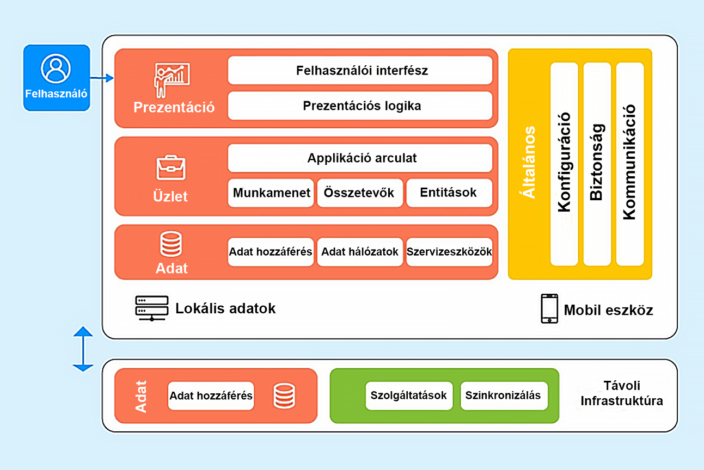
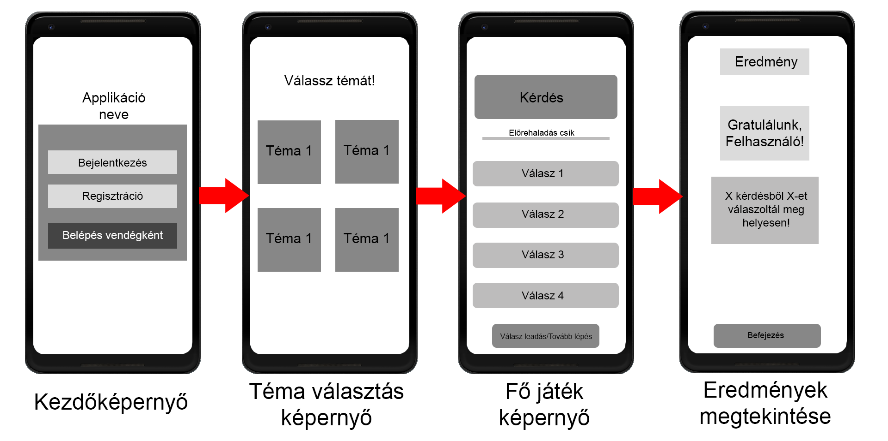

# Rendszerterv
## 1. Bevezetés, az applikáció célja

**Mi a célunk a Kvíz Alkalmazással?**

Szeretnénk, ha az alkalmazásunk kiküszöbölné az alapvető problémákat, amik megjelenhetnek a mai online kvíz alkalmazásokkal.

**Az alkalmazás adatainak nyilvántartása**

A mobil applikáció egy a mobilokon, azaz okostelefonokon futó szoftver, alkalmazás vagy program.
Az alapvető, gyárilag feltelepített mobil applikációkon kívül még tölthetünk le olyan alkalmazásokat, amelyek alapvetően ugyan nem érhetőek el a telefonunkon, de a telefonunkra letölthetjük őket.
Az alábbi paraméterei lehetnek:
- Általános adatok: kérdések, válaszok, téma, eredmények
- Felelősök: Minden fejlesztő, aki partnerségben van velünk, vagy nálunk dolgoznak, engedélyezett számukra az alkalmazás fejlesztése
- Előterjesztők: A tesztelő csapatunk különböző időintervallumonként elkészített demókat ellenőriznek, javaslatokat tesznek a javításokra.
- Állapotok: Az alkalmazás fejlesztésének számos lépései vannak, ezek a következők:
   - Tervezés és kutatás
	    - A tervezési szakasznak azonnal meg kell történnie, miután elképzeltük az alkalmazás ötletét. A "tervezés" itt nem azt jelenti, hogy eldöntjük, hogyan fog kinézni az alkalmazás vagy hogyan programozzuk azt; a tervezési szakasznak inkább arra kell törekednie, hogy több magas szintű kérdést megválaszoljon az elképzeléseinknek a jelenlegi piaci térben való megvalósíthatóságáról.
   - Prototípuskészítés
	    - A prototípuskészítés az a szakasz, ahol gyorsan elkezdődik a drótvázak létrehozása és a felhasználói visszajelzések ismétlése. A drótváz felfogható az alkalmazás felhasználói felületének és felhasználói felhasználói élményének alacsony pontosságú útmutatójaként, és általános képet ad az alkalmazás működéséről és folyamatáról anélkül, hogy belemenne a színek vagy stílusok apróbb részleteibe. A drótvázaknak nem kell teljes körűen szerepelniük – csak összpontosítson az alkalmazás alapvető funkcióinak megjelenítésére, és erről visszajelzést kapjon.
   - Tervezés
	    - Az alkalmazásfejlesztés tervezési szakaszának számos összetevője van, ezért csak röviden ismertetjük a legfontosabbakat. Először is, az UX és UI tervezők feladata, hogy tovább finomítsák a jóváhagyott drótvázakat. Ez azt jelenti, hogy el kell helyezni és elkészíteni a felhasználói felület elemeit, meghatározni a felhasználói áramlást, megérteni az elemhierarchia fontosságát, stb. Ezen a ponton nagy pontosságú maketteket kell készítenie, amelyeket a fejlesztők működő alkalmazássá alakíthatnak a történések részleteivel együtt.
   - Fejlesztés
	    - A fejlesztési szakasz az, ahol ténylegesen elkezdjük írni az alkalmazás „végső” verziójának kódját. Itt használjuk fel a drótvázaktól kapott visszajelzéseket, és hozzunk néhány végső, potenciálisan nagy döntést.
   - Tesztelés
	    - Ideális esetben a tesztelés a fejlesztési szakaszsal párhuzamosan történik. Fontos a folyamatos tesztelés, hogy a kiadás utáni költségek alacsonyak legyenek. Az egységtesztekre, a felhasználói felület tesztekre és az integrációs tesztelésre azért van szükség, hogy a lehető legkorábban kijavítsa a nagyobb hibákat vagy hibákat. A tesztesetek megnövelhetik a fejlesztési szakaszban eltöltött időt, de hosszú távon drámaian csökkenthetik a karbantartás és a támogatás idő- és pénzbeli költségeit.
   - Kiadás
	    - Itt kell jóváhagyásra beküldenünk alkalmazását a Play Áruház App Store-jába. Ennek a folyamatnak a megtanulása fontos, mivel ezt minden alkalommal meg fogja tenni, amikor kiadja az alkalmazás új verzióját. A fejlesztési folyamat ezen a pontján ki kellett volna javítani a legtöbb főbb hibát, amelyet a tesztelők találtak, és rendelkeznie kellett egy minőségi alkalmazással, amely megfelel az üzletre vonatkozó irányelveknek, ahová feltöltjük.
   - Karbantartás
	    - Ez a szakasz valójában a kiadással egy időben kezdődik, és ezzel párhuzamosan kell haladnia. A karbantartás során figyelemmel kísérhetjük az alkalmazás állapotát, kijavíthatjuk az esetlegesen előforduló hibákat, és győződjünk meg arról, hogy az alkalmazás továbbra is a várt módon működik. Az alkalmazás frissítése az operációs rendszer új verzióira, vagy új eszközök támogatása szintén a karbantartás része.

**Felhasználói adatok tárolása**

Az alkalmazást bejelentkezve lehet használni, ehhez regisztrálnia kell a felhasználónak, vagy vendégként belépnie.
A regisztrált felhasználók email és jelszó párossal tudnak bejelentkezni.  
Az alábbi jogosultsági szinteket különböztetjük meg:

   - Felhasználó
   - Vendég

**A felhasználókról nyilvántartott adatok:**

- Általános adatok: email cím*, felhasználónév*, jelszó*

## 2. Mobilalkalmazás architektúra diagram

  
Megjegyzés: Az ábra csupán demonstráló értékű.

## 3. Adattárolás

A kvíz alkalmazásunk által tárolt személyes információkat JSON fájlban akarjuk tárolni. Ebbe beleértve a felhasználói adatokat, valamint az adminisztrátoraink által
feltöltött kvíz kérdéseket is (az ő adataik mellett). Az oldalnak képesnek kell lennie eltárolni a megadott adatokat regisztrálás után, valamint beolvasni és
értelmezni ezen adatokat bejelentkezéskor, valamint az alkalmazás használata közben is. Az adattárolás a következő tárhelyszolgáltatással lesz megvalósítva: Firebase.
Itt fogjuk tárolni az adatokat a felhasználokról. Minden adat tárolás a jogszabályoknak megfelelően lesznek tárolva. 

## 4. Alkalmazás menüjeinek kialakítása

A felhasználói élmény tisztán az ügyfelek elégedettségi szintjének növelésén alapul, és elsősorban az optimális használhatóság és az alkalmazáshoz való jobb hozzáférés
biztosítására összpontosít.
A felhasználói felület tervezőinek az egyértelműségre kell összpontosítaniuk. Használjuk az ismerős gombokat vagy a Call-to-Actions-öket. Az alkalmazás
teljesítményének gyorsnak kell lennie.
Válasszuk ki a megfelelő méretű betűtípusokat, fontos, hogy esztétikus legyen.

## 5. Az applikációhoz használt szoftver

Kvíz játék alkalmazásunkat Android eszközökre tervezzük. Ebből kifolyólag az Android Studio nevű szoftvert fogjuk használni alkalmazásunk fejlesztéséhez.
Az Android Studio nélkül nem beszélhetünk androidos alkalmazásfejlesztésről. Ez a legalapvetőbb eszköz az Android fejlesztők számára. A Google 2013-ban hozta létre, 
és mára nagyjából az Android fejlesztők alapszoftverévé vált. Azért nagyszerű eszköz, mert a Google támogatását, valamint a fejlesztők nagy közösségét élvezi.
Applikációnk Kotlin programozási nyelvben fog íródni. 

## 5. Az applikáció megjelenítése

Applikációnk fejlesztése során törekszünk arra, hogy esztétikus alkalmazást tudjunk létrehozni.
A színeknek harmónikusaknak kell lenniük, hogy ne zavarja a felhasználók látását, ugyanakkor
szaturált színek használata előnyös a figyelemfelkeltés végett. Illetve létrehozásra kerül egy sötét üzemmód is, hogy felhasználóink zavartalanul tudják használni kvíz
játékunkat akár egy sötétebb környezetben is. Fontosnak tartjuk, hogy egy könnyen kezelhető, illetve felhasználóbarát kvíz alkalmazást tudjunk létrehozni, amit kicsik 
és nagyok is egyaránt élvezni tudjanak. Könnyen kezelhetőség érdekében letisztult formákat, ikonokat és dizájnt használunk. Külön ablakban lesz sor a regisztrációra,
ahol e-mail cím, jelszó és felhasználónév megadása kötelező. A kvíz játékunk különböző témakörei szintén egy egy másik ablakban lesz megjelenítve. A témakör sikeres
kiválasztása után megjelennek a kérdések. Bejelentkezett felhasználó esetén lehetőség van ott folytatni a kérdések megválaszolását, ahol a felhasználó az utóbbi játéka
során abbahagyta

  
Megjegyzés: Az ábra csupán demonstráló értékű.

## 6. Rendszer használatának szabályai

Kvíz applikációnk regisztráció nélkül is elérhető, illetve használható. Regisztrációra bármikor lehetőség van e-mail cím, felhasználó név és jelszó megadásával. A
jelszavas bejelentkezést követően a különböző felhasználói csoportoknak más-más lehetőségeik lesznek a rendszerben. Két felhasználói csoport létezik (bejelentkezést 
követően): adminisztrátor és felhasználó.  

**Felhasználó:**  
	-Eléri az összes kvíz kérdést  
	-Eléri az összes témakört  
	-Lehetősége van megtekinteni a meg nem válaszolt kérdéseket  
	-Lehetősége van megtekinteni az eddigi elért pontszámát  
	-Lehetősége van megtekinteni az eddigi teljesítményét  
	-Lehetősége van megtekinteni az eddigi fejlődését  
	-Értékelheti az eddigi megválaszolt kérdéseket  
	-Értékelheti a témaköröket  

**Adminisztrátor:**  
-Minden általa közzétett kvíz kérdést teljes jogkörrel módosíthat  
-Minden általa közzétett kvíz témakört teljes jogkörrel módosíthat  
-Új kérdésekkel bővíthetje a különböző témaköröket  
-Új témakörökkel bővíthetje az alkalmazást  
-Már hozzáadott kérdéseket törölhet  
-Már hozzáadott témakört törölhet  
-Hozzáfér a rendszerfelületi modulhoz  

**Vendég:**  
-Eléri az összes kvíz kérdést  
-Eléri az összes témakört  

## 7. Fogalomtár

**Android Studio:**   
Android Studio is the official integrated development environment (IDE) for Google's Android operating system, built on JetBrains' IntelliJ IDEA
software and designed specifically for Android development. It is available for download on Windows, macOS and Linux based operating systems. It is a replacement for
the Eclipse Android Development Tools (E-ADT) as the primary IDE for native Android application development.  

**Kotlin:**  
Kotlin is a cross-platform, statically typed, general-purpose programming language with type inference. Kotlin is designed to interoperate fully with Java, 
and the JVM version of Kotlin's standard library depends on the Java Class Library, but type inference allows its syntax to be more concise. Kotlin mainly targets 
the JVM, but also compiles to JavaScript or native code via LLVM Language development costs are borne by JetBrains, while the Kotlin Foundation protects the Kotlin
trademark.  

**Firebase:**  
Firebase is a set of hosting services for any type of application (Android, iOS, Javascript, Node.js, Java, Unity, PHP, C++ ...). It offers NoSQL and real-time hosting of databases, content, social authentication (Google, Facebook, Twitter and Github), and notifications, or services, such as a real-time communication server.
Firebase evolved from Envolve, a prior startup founded by James Tamplin and Andrew Lee in 2011. Envolve provided developers an API that enables the integration of online chat functionality into their websites.
After releasing the chat service, Tamplin and Lee found that it was being used to pass application data that were not chat messages. Developers were using Envolve to sync application data such as game state in real time across their users. 
Tamplin and Lee decided to separate the chat system and the real-time architecture that powered it. They founded Firebase as a separate company in 2011 and it launched to the public in April 2012

